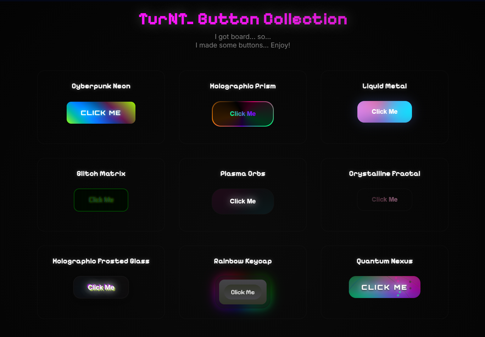

# TurNT Button Collection

Just a collection of some buttons I've made with spam-friendly sound shuffle system.

## Stats

## Live Preview

Check out the button collection here: **[https://to0turnt.github.io/TurNT_ButtonCollection/](https://to0turnt.github.io/TurNT_ButtonCollection/)**

## Features

- **9 Unique Button Styles**: Each button has its own visual effects and animations
- **Interactive System**: Each button plays a fun sound and visual effect when clicked
- **Spam-Friendly Shuffle**: Click the same button repeatedly to spam your favorite sound, then click a different button to shuffle all sounds to new random assignments

## About

A showcase of various custom button designs and styles created for web projects. Each button features unique visual effects, animations, and sound feedback for an engaging interactive experience.

## Usage

Feel free to browse the collection and use these buttons in your own projects!

## License

This project is licensed under the TurNT Button Collection License (Version 1.0) - see the [LICENSE](LICENSE) file for details.

**TL;DR:** Free to use with attribution! You must credit "TurNT Button Collection" with a link back to this repo when using these buttons in your projects. Cannot be resold as a standalone product.
